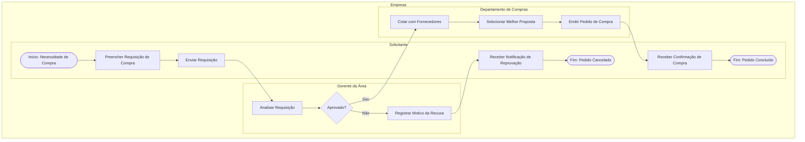
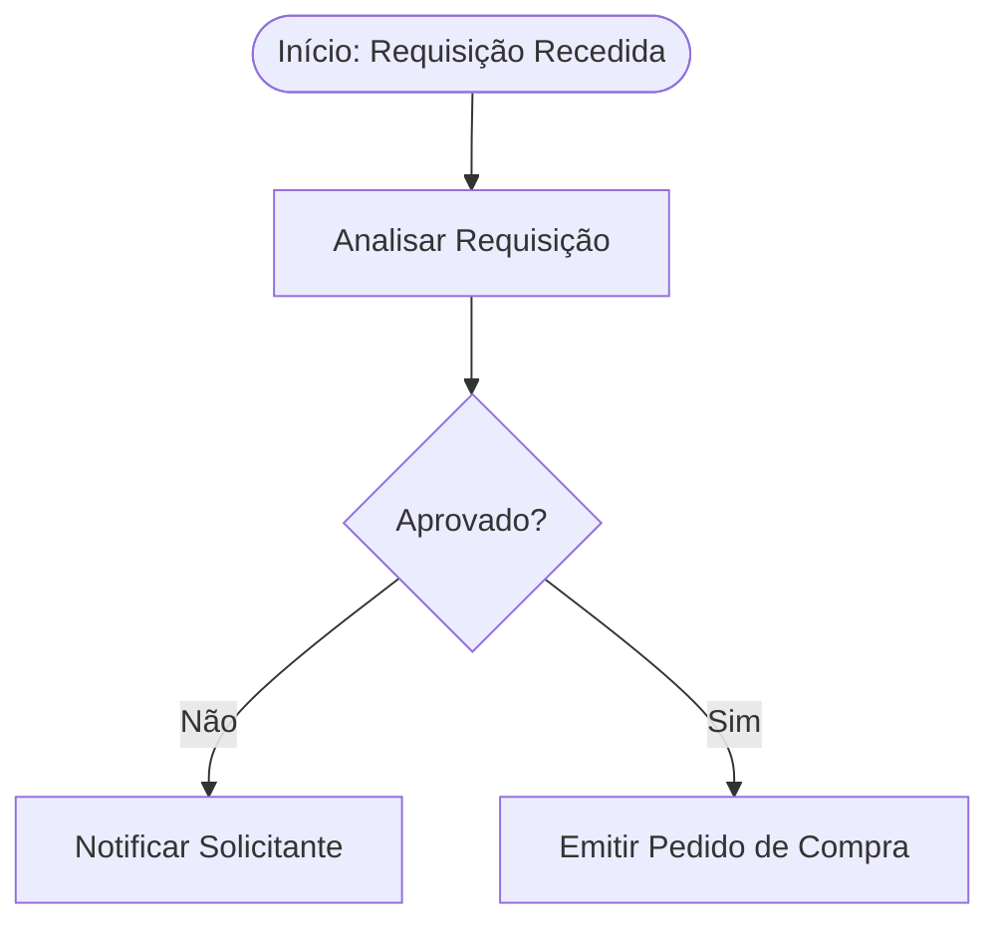

# Mapeamento de Processos de Negócio com IA
---

### 1. Panorama Atual do Uso de IA no Mapeamento de Processos

A aplicação de Inteligência Artificial no mapeamento e gestão de processos de negócios (BPM) mudou o foco da **documentação manual** para a **descoberta e otimização automatizadas**. O ecossistema atual se divide em três principais frentes:

* **Process Mining + IA Generativa:** Plataformas consolidadas como *Celonis*, *UiPath* e *Microsoft Power Automate* combinam *Process Mining* (análise de logs de sistemas como SAP e Salesforce) com IA generativa. A IA cruza dados de eventos reais, detecta gargalos operacionais e traduz insights técnicos em relatórios executivos em linguagem natural.
* **Geração de Diagramas via Prompt (Text-to-Flow):** Ferramentas como *Miro AI*, *Lucidchart*, *Whimsical* e *ShiftX* permitem gerar fluxogramas e diagramas BPMN a partir de transcrições de reuniões, políticas internas ou descrições em texto simples, reduzindo o tempo inicial de modelagem.
* **Simulação e Diagnóstico de Impacto:** IAs preditivas analisam cenários *"What-If"*. É possível simular como a mudança em uma etapa da cadeia de suprimentos ou no atendimento ao cliente afetará o tempo total do ciclo e os custos antes de implementar a alteração.
---
### 2. Exemplo prático de prompt

A forma mais eficiente de gerar diagramas em sintaxe BPMN via IA generativa é solicitar a saída no formato **Mermaid.js** ou **PlantUML**. Esse código pode ser colado diretamente em editores visuais (como Mermaid Live Editor, Draw.io ou Notion) para renderizar o diagrama automaticamente.

Abaixo está a estrutura completa do prompt e o resultado esperado.


#### Prompt Estruturado (Copie e cole no ChatGPT, Claude ou similar)

> **Contexto:** Você é um especialista em Gestão de Processos de Negócio (BPM) e especialista na notação BPMN 2.0.
> **Objetivo:** Mapear o processo de **Aprovação e Compra de Suprimentos Corporativos** e fornecer a saída em código **Mermaid.js** para visualização do diagrama.
> **Regras de Mapeamento:**
> 1. Organize o processo em uma **Piscina (Pool)** chamada "Empresa" com 3 **Raias (Lanes)**: *Solicitante*, *Gerente da Área* e *Departamento de Compras*.
> 2. Use os eventos de início e fim apropriados.
> 3. Inclua um gateway de decisão (**Gateway Exclusivo - XOR**) para aprovação do gerente:
> * Se **Aprovado**: avança para o Departamento de Compras.
> * Se **Reprovado**: encerra o processo com a notificação do solicitante.
> 
> 
> 4. Defina os tipos de tarefas com clareza (ex: Notificar, Analisar, Executar).
> 
> 
> **Formato de Saída:**
> * Forneça uma breve explicação textual dos passos.
> * Forneça APENAS o bloco de código Mermaid funcional (utilizando `graph TD` ou `sequenceDiagram` para representar as interações das raias).
> 
> 


#### Exemplo de Resposta Gerada pela IA

##### Descrição Resumida do Fluxo

1. **Solicitante:** Preenche e envia a requisição de compra.
2. **Gerente:** Recebe a notificação e analisa o valor e a justificativa.
* **Cenário A (Reprovado):** O solicitante é notificado e o processo termina.
* **Cenário B (Aprovado):** O pedido é encaminhado para Compras.


3. **Departamento de Compras:** Cota com fornecedores, emite o pedido de compra e finaliza o processo.

#### Código Mermaid.js (Copie para testar no [Mermaid Live Editor](https://mermaid.live))



**Abaixo o código mermaid do gráfico acima**
>graph TD
    subgraph Empresa
        subgraph Solicitante
            A([Início: Necessidade de Compra]) --> B[Preencher Requisição de Compra]
            B --> C[Enviar Requisição]
            H[Receber Notificação de Reprovação] --> I([Fim: Pedido Cancelado])
            M[Receber Confirmação de Compra] --> N([Fim: Pedido Concluído])
        end
        subgraph Gerente_Area [Gerente da Área]
            C --> D[Analisar Requisição]
            D --> E{Aprovado?}
            E -- Não --> F[Registrar Motivo da Recusa]
            F --> H
        end
        subgraph Depart_Compras [Departamento de Compras]
            E -- Sim --> J[Cotar com Fornecedores]
            J --> K[Selecionar Melhor Proposta]
            K --> L[Emitir Pedido de Compra]
            L --> M
        end
    end

---
### 3. Converter para BPMN 2.0 (Cmaunda ou Bizagi)
---

Para converter um diagrama gerado em Mermaid.js para o formato padrão **BPMN 2.0 (XML)** compatível com Camunda ou Bizagi, é necessário realizar uma conversão de estrutura, pois o Mermaid utiliza uma sintaxe simplificada focada em visualização, enquanto o XML BPMN é um padrão rigoroso que armazena metadados operacionais e coordenadas visuais.

A forma mais rápida e precisa de realizar essa conversão é **utilizar a própria IA como tradutora de sintaxe**.


#### Mapeamento Direto via IA Generativa

Você pode solicitar diretamente à IA que converta a lógica do Mermaid para o arquivo XML no padrão BPMN 2.0.

##### Prompt de Conversão (Copie e cole na IA)

> **Contexto:** Você é um especialista em arquitetura de processos de negócios e no padrão de especificação OMG BPMN 2.0.
> **Objetivo:** Converter o código Mermaid.js fornecido em um arquivo XML válido no padrão BPMN 2.0 (sintaxe `.bpmn`), pronto para ser importado em ferramentas como Camunda Modeler, Bizagi Modeler ou Signavio.
> **Regras do Arquivo XML:**
> 1. Deve conter a tag raiz `<bpmn:definitions>` com as namespaces corretas do BPMN 2.0.
> 2. Deve incluir a seção `<bpmn:process>` definindo os nós (tasks, gateways, events, sequenceFlows).
> 3. Se houver raias/piscinas, estruture com `<bpmn:collaboration>`, `<bpmn:participant>` e `<bpmn:laneSet>`.
> 4. Inclua a seção de diagrama `<bpmndi:BPMNDiagram>` e `<bpmndi:BPMNPlane>` básica para permitir que o arquivo seja renderizado visualmente ao abrir na ferramenta.
> 
> 
> **Código Mermaid de Entrada:**
>
> [COLE O CÓDIGO MERMAID AQUI]
>  
> 
> **Saída:** Forneça APENAS o bloco de código XML dentro de um bloco de código `xml`.


#### Sequência para Importação nas Ferramentas

1. **Gerar o XML com a IA:** Passo 1.
Execute o prompt acima fornecendo o seu código Mermaid.


2. **Salvar o Arquivo:** Passo 2.
Copie o código XML gerado, abra um editor de texto simples (como Bloco de Notas ou VS Code) e salve o arquivo com a extensão **`.bpmn`** ou **`.xml`** (exemplo: `processo_compras.bpmn`).


3. **Importar na Ferramenta:** Passo 3.
* **No Camunda Modeler:** Abra o programa, vá em `File` > `Open File` e selecione o arquivo `.bpmn`.
* **No Bizagi Modeler:** Vá em `Avançado` > `Importar` > `BPMN` e selecione o arquivo `.bpmn`.


#### Alternativas de Ferramentas Intermediárias

Se você preferir não usar o prompt de conversão direta em XML, existem duas rotas alternativas:

1. **bpmn.to (Ferramenta Web):** Algumas ferramentas utilitárias na web e scripts em Python (como o pacote `bpmn-python`) ajudam na conversão estrutural de grafos para XML, embora o layout visual precise de ajustes manuais após a importação.
2. **Desenho Rápido via bpmn.io:** Se o XML gerado pela IA apresentar falhas de renderização de layout (posicionamento das caixas), você pode colar a descrição textual do processo na ferramenta **bpmn.io/demo** ou usar extensões de IA integradas ao Camunda para gerar o fluxo do zero direto na interface gráfica.

---
### 4. Além do Fluxo BPMN, agregar propriedades estendido (Documentação/Descrição)
---
Sim, é totalmente possível. No **Bizagi Modeler**, assim como no **Camunda** e em outras ferramentas BPMN profissionais, cada elemento do fluxo (uma tarefa, um gateway ou um evento) possui um **painel de propriedades estendido** (Documentação/Descrição) onde são armazenados textos explicativos, regras de negócio, responsáveis, prazos e insumos.

Quando usamos IA, podemos **gerar o fluxo visual e a documentação textual completa ao mesmo tempo**.

Abaixo estão as duas formas principais de fazer isso no seu fluxo de trabalho:


#### Formato 1: Matriz de Documentação + Diagrama (O Padrão Corporativo)

O método mais eficiente é pedir à IA que entregue um relatório estruturado em duas partes: o diagrama gráfico (Mermaid ou BPMN XML) e uma **Tabela de Dicionário do Processo**, detalhando o que acontece em cada caixa do diagrama.

##### Exemplo de Estrutura Gerada por IA:

###### 1. Diagrama do Processo



##### 2. Dicionário de Atividades (Documentação no Estilo Bizagi)


| ID / Elemento | Tipo BPMN | Nome da Atividade | Descrição Detalhada / Procedimento | Regras de Negócio & SLAs |
| :--- | :--- | :--- | :--- | :--- |
| **A** | Evento de Início | Requisição Recebida | O sistema captura o formulário de compras enviado pelo solicitante. | Deve conter justificativa e centro de custo. |
| **B** | Tarefa de Usuário | Analisar Requisição | O Gerente avalia a viabilidade do gasto e a disponibilidade orçamentária. | **SLA:** 24 horas úteis.<br>**Aprovador:** Gerente da área. |
| **C** | Gateway Exclusivo | Aprovado? | Avalia a decisão tomada na etapa B. | Se valor > R$ 10.000, requer aprovação da Diretoria. |
| **D** | Tarefa de Envio | Notificar Solicitante | Envia e-mail automático com o motivo da recusa. | O processo encerra após o envio. |
| **E** | Tarefa de Serviço | Emitir Pedido | O sistema ERP envia a ordem de compra para o fornecedor cadastrado. | **Integração:** API do ERP SAP/TOTVS. |


#### Formato 2: Tags de Documentação Incorporadas no XML BPMN 2.0

Se o seu objetivo é **importar o arquivo direto no Bizagi ou Camunda já com os textos preenchidos dentro das caixas**, você pode pedir para a IA incluir a tag `<bpmn:documentation>` dentro do arquivo `.bpmn` (XML).

Quando você abre o arquivo no Bizagi, o texto aparece automaticamente na aba **"Documentação"** de cada tarefa.

##### Exemplo de Trecho XML BPMN 2.0 com Documentação:

```xml
<bpmn:userTask id="Activity_Analisar" name="Analisar Requisição">
  <bpmn:documentation>
    OBJETIVO: Avaliar a viabilidade orçamentária do pedido.
    RESPONSÁVEL: Gerente da Área.
    PROCEDIMENTO:
    1. Acessar o sistema ERP no módulo de Compras.
    2. Verificar se o valor está dentro do orçamento mensal do centro de custo.
    3. Aprovar ou reprovar anexando o parecer técnico.
    SLA: 24 horas.
  </bpmn:documentation>
</bpmn:userTask>

```


#### Como pedir isso à IA (Prompt Pronto)

Adicione a seguinte instrução ao seu prompt habitual de mapeamento:

> *"Além do diagrama [Mermaid / XML BPMN], gere uma **Tabela de Dicionário do Processo** detalhando cada elemento. Para cada tarefa, inclua: (1) Descrição do procedimento passo a passo, (2) Papel/Responsável, (3) Regras de Negócio aplicáveis, e (4) SLA de atendimento. Se for gerar XML BPMN, insira essa descrição dentro das tags `<bpmn:documentation>` de cada nó."*


#### Como gerar a Documentação em Word/PDF (Igual ao Publish do Bizagi)

Se você precisa entregar um **Manual de Processos (POP - Procedimento Operacional Padrão)** em documento oficial:

1. Solicite à IA: *"Com base no fluxo acima, crie o Manual de Processo completo formatado em Markdown para exportação."*
2. A IA organizará os tópicos em:
* Objetivos e Escopo do Processo
* Matriz RACI (Responsável, Aprovado, Consultado, Informado)
* Procedimento Detalhado por Etapa
* Indicadores de Desempenho (KPIs) e Riscos do Processo.


---
### Curadoria

#### 2. Literatura Recomendada (Português e Inglês)

Atualmente, **não existem livros focados exclusivamente no nicho de "IA para Mapeamento de Processos"**, pois o mercado evolui em ritmo acelerado. As melhores referências dividem-se em fundamentos de BPM/Mapeamento e aplicação prática de IA/Process Mining:

##### Em Português

* **BPM CBOK V4.0 (Guia para o Gerenciamento de Processos de Negócio)** – *ABPMP*: Leitura obrigatória sobre os fundamentos do ciclo de vida de BPM. Essencial para saber o que avaliar nos modelos criados por IA.
* **Transformação Digital: Mantendo a Competitividade na Era da Inteligência Artificial** – *David L. Rogers*: Aborda a reestruturação e automação de processos dentro da transformação digital das empresas.

##### Em Inglês

* **Process Mining: Data Science in Action** – *Wil van der Aalst*: Considerado o "pai do Process Mining", o autor explica a base teórica e prática da descoberta automatizada de processos a partir de logs de dados.
* **Fundamentals of Business Process Management** – *Marlon Dumas, Marcello La Rosa, Jan Mendling, Hajo A. Reijers*: A maior referência acadêmica e prática sobre análise, redesign e automação de processos.
* **Artigos e Whitepapers de Mercado:** Publicações de consultorias como *Gartner*, *McKinsey* e os blogs técnicos da *Celonis* contêm estudos de caso atualizados sobre GenAI aplicada à gestão de processos.


#### 3. Cursos Recomendados

Não vale a pena investir em cursos genéricos e caros de "Process Mapping tradicional" esperando aprender IA. As opções mais relevantes se concentram no aprendizado do uso de **ferramentas modernas (Process Mining e GenAI)**:

* **Celonis Academy (Gratuito / Inglês com legendas):** Oferece rotas de aprendizado focadas em *Process Mining* e *Execution Management System (EMS)*. É o treinamento mais alinhado à automação e análise inteligente de dados de processos no ambiente corporativo.
* **UiPath Academy – Automation Explorer / Process Mining (Gratuito / Inglês e Espanhol):** Excelente para quem quer aprender a integrar mapeamento automatizado com automação de processos (RPA) e agentes de IA.
* **Cursos práticos na Udemy (Português e Inglês):** Procure por treinamentos focados em *Prompt Engineering para Analistas de Negócios* ou uso de *Miro/Lucidchart com IA* e *Microsoft Power Automate Process Mining*.
* **TreinamentosOficiais de BPMN com IA:** Instituições como a *ABPMP Brasil* promovem workshops e webinars frequentes focados no impacto da IA generativa no trabalho do analista de processos.